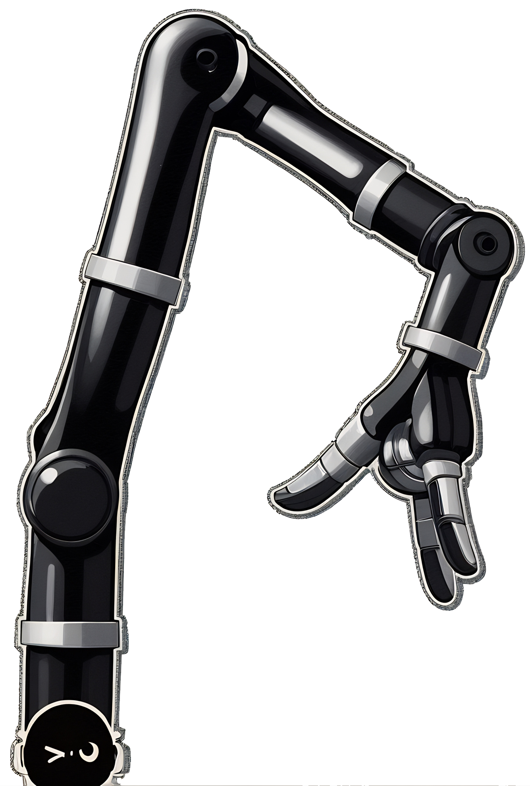
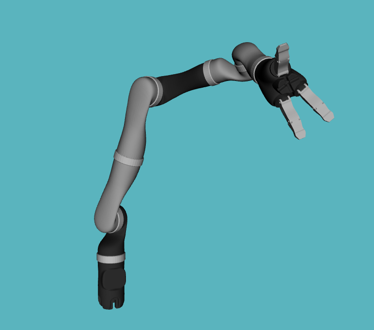
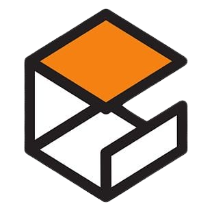

<div align="center">

#  JACO2 Robotic Arm Simulation


-orange.svg)
 


*Welcome to the ***JACO2 Robotic Arm Simulation*** project!*        


A complete ROS 2-powered simulation & motion planning toolkit for the Kinova JACO2 — built to move smarter. 




---
</div>

## Table of Contents
- [Overview](#-overview)
- [Project Structure](#-project-structure)
- [Key Features](#-key-features)
- [Dependencies](#️-dependencies)
- [Installation](#-installation)
- [Usage](#-usage)
- [Testing Checklist](#-testing-checklist)
- [Acknowledgements](#-acknowledgements)
- [Contributions](#-contributing)
- [License](#-license)
- [Author](#-author)
<br>

## 🔍 Overview
This project focuses on the simulation and control of a **7-DOF Kinova JACO2** robotic arm using the **ROS 2**, **Gazebo Sim**, and **MoveIt 2** frameworks. The manipulator is modeled using a URDF/Xacro description adapted from the official [Kinova JACO2](https://github.com/Kinovarobotics) resources, and is equipped with configurable joint interfaces and controller setups. Simulation is executed in **Gazebo Sim**, leveraging **ROS 2-Control** for actuation and feedback and added support for visualization using **Rviz 2**. Motion planning, trajectory execution, and task-level behaviors are handled through **MoveIt 2**, including support for interactive planning and advanced task constructors.

Designed for research, development, and experimentation in robotic manipulation, this project provides a modular and extensible simulation environment. It integrates widely adopted robotics frameworks to support prototyping of autonomous manipulation pipelines, motion planning algorithms, and teleoperation workflows in a high-fidelity virtual environment.
<br>

## 📂 Project Structure  

```bash
jaco2_sim_devkit
├── jaco2_bringup                       # Linux shell scripts to launch simulation setup 
├── jaco2_controller                    # ROS2 and Gazebo controllers configuration pkg
├── jaco2_description                   # URDF and mesh files for Jaco2 manipulator
├── jaco2_gazebo                        # Models and world files for Gazebo sim setup
├── jaco2_jaco_arm_ikfast_plugin        # IKFast solver plugin for jaco_arm
├── jaco2_media                         # Images, videos and gifs from simulation
├── jaco2_moveit_config                 # Moveit2 setup for Jaco2 manipulator
├── jaco2_moveit_demos                  # MoveitPy manipulation demo scripts 
├── jaco2_moveit_task_constructor       # Moveit Task Constructor demo scripts for Jaco2
├── jaco2_servo                         # Joystick and Keyboard controlled simulation setup 
├── jaco2_sim_devkit                    # Meta-package description for Jaco2 simulation project package
└── jaco2_utils                         # Necessary modules for simulation and study
```

>[!Note]
> 📄 Each package includes its own README file for specific usage, configurations, and setup instructions.

<br>

## ✨ Key Features

- ®️ **Official URDF/Xacro Model**     
  Uses the official Kinova JACO2 robot description from the Kinova repository for accurate and standardized robot modeling.     

-  **Complete Gazebo Simulation**  
  Compatible with Gazebo Sim, including support for environmental objects and simulated sensor plugins (e.g., RGBD cameras).

- 🖥️ **Integrated RViz2 Visualization**  
  Seamless RViz2 support for 3D robot visualization, joint states, and interactive markers for planning.

- :gear: **ROS 2 Control Integration**  
  Actuation and feedback powered by ROS 2 Control; fully synchronized with Gazebo simulation and real-time joint controllers.

-  **Motion Planning with MoveIt 2**  
  Enables motion planning, inverse kinematics, and interactive goal control using the MoveIt 2 framework.

- 🧠 **Task-Level Execution via MoveIt Task Constructor**  
  Supports complex manipulation workflows using MoveIt Task Constructor for chained task planning and logical behavior trees.

- 🎮 **Teleoperation Interfaces**  
  Includes keyboard and joystick-based control for both **joint-level** and **Cartesian-space** movements of the manipulator. 

- :globe_with_meridians: **3D Workspace Construction**  
  Tools for building and visualizing custom 3D workspaces for benchmarking, object placement, and simulation scenarios.      

<br>

## 🛠️ Dependencies
 
Make sure you have the following installed:
- **Ubuntu**: 24.04 or higher
- **Robot Operating System (ROS 2)**: Jazzy 
- **Gazebo Sim**: Harmonic
- **Moveit 2.0**: Jazzy
- **Moveit Task Constructor**
- **Python**: 3.8 or higher
<br>

## 📦 Installation

:pushpin: Clone the repository inside a ROS 2 workspace
```bash
cd ros2_ws/src   # navigate inside the ROS 2 workspace
git clone https://github.com/VibhuSharma19/jaco2_sim_devkit.git
```
:pushpin:  Install the dependencies required (if not installed)
```bash
cd ros2_ws
rosdep install --from-paths src --ignore-src -r -y
```
:pushpin: Build the workspace and source it
```bash
colcon build 
source install/setup.bash
```
<br>

## 🧭 Usage
##### 🚀 Launch GazeboSim Simulation: 
```bash
 jaco2_gazebo.sh 
```

##### 🚀 Launch GazeboSim World Simulation: 
```bash
jaco2_gazeboworld.sh
```

##### 🚀 Launch Simulation with Moveit: 
```bash
jaco2_gazebo_moveit.sh
```

##### 🚀 Launch Rviz visualization: 
```bash 
ros2 launch jaco2_description display.launch.py
```

> [!Important]
> Make sure to have your ROS2 environment sourced
> ```bash
> source ~/ros2_ws/install/setup.bash
> ```

<br>

## 📽️ Key Visual Demos

- ##### :video_camera: Gazebo Simulation control using Joint State Publisher


- ##### :video_camera: End-Effector Pose tracking


- ##### :video_camera: Pick-Place using Moveit Task Constructor


<br>

## 🧪 Testing Checklist

- [x] URDF loads without errors in RViz   
- [x] Joints respond to controllers
- [x] MoveIt2 can plan to target poses
- [x] Gazebo simulation and sensors responds to physics
- [x] Keyboard and Joystick teleoperation works seamlessly
- [x] Scripts run successfully

<br>

## 📚 Acknowledgements
:closed_book: [Automatic Addison](https://automaticaddison.com/tutorials/#Jazzy)    
:green_book: [ROS 2](https://docs.ros.org/en/jazzy/index.html)    
:blue_book: [ROS 2 Control](https://control.ros.org/jazzy/index.html)    
:closed_book: [Gazebo Sim](https://gazebosim.org/docs/harmonic/building_robot/)    
:blue_book: [Moveit 2](https://moveit.picknik.ai/main/index.html)    
:orange_book: [Moveit Task Constructor](https://moveit.github.io/moveit_task_constructor/index.html)    
 
<br>

## 🤝 Contributing 

Contributions are welcome! Please:

- Follow ROS2 coding guidelines
- Format launch files cleanly
- Test your features before submitting PRs
- Add comments and docstring

<br>

## 📜 License
This project is licensed under the **BSD 3-Clause License** — see the [LICENSE](./LICENSE) file for details.

<br>

## 👤 Author

***Vibhu Sharma***       
:mortar_board: M.Tech(🥇) -  Automation and Robotics    
 🔗 GitHub: [VibhuSharma19](https://github.com/VibhuSharma19)     
 📧 Email: 1999vibhusharma@gmail.com       

<br>

<br>

## 🛡️ Project Signature

<div align="center">


</div>

---

<div align="center">


 ### 🎯 So… what’s this all about?
 ##### **Just a mechanical arm...** 🦾
 #### *who’s got some moves.* 🕺

</div>

---
