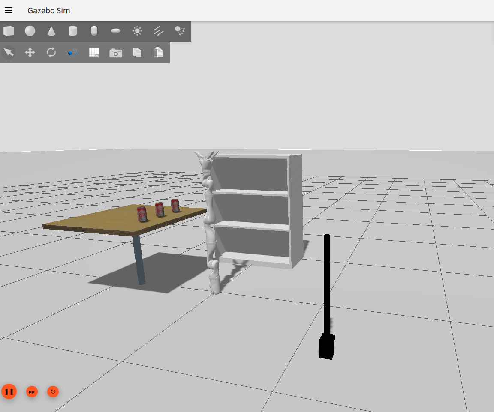

## 🖼️ jaco2_media

> This folder contains **media assets** (images, GIFs, icons, and videos) related to the [jaco2_sim_devkit](https://github.com/VibhuSharma19/jaco2_sim_devkit) simulation project.  
> It is **not** a ROS 2 package — just a regular directory used to support documentation, demos, and visual debugging.

---

### 📁 <ins>Folder Structure

```bash
jaco2_media
├── gifs/         # Animated demonstrations (e.g., motion planning, object tracking)
├── icons/        # Logo icons, badges, and visual markers
├── images/       # Screenshots of simulation states, URDFs, RViz, Gazebo, etc.
└── videos/       # MP4 video recordings of JACO2 in action
```
<br>

### 🔧 <ins>Usage

These assets are used across:

   - README.md files in each subpackage

   - Visual documentation and tutorials

   - Presentations, demos, or user-facing reports

:camera: Image Example
```markdown

```

:film_projector: GIF Example
```markdown

```

:film_projector: Video Link Example
```markdown
[Watch Full Simulation Demo (MP4)](../jaco2_media/videos/jsp_gui_control.mp4)
```
<br>

### ✍️ <ins>Notes

- Make sure to compress large files before pushing to Git

- Avoid storing raw footage — trim videos to key clips

- You can `.gitignore` heavy files if using Git LFS

<p align="center"> <sub>This media folder supports the <a href="https://github.com/VibhuSharma19/jaco2_sim_devkit">jaco2_sim_devkit</a> ROS 2 simulation project.</sub> </p> 

